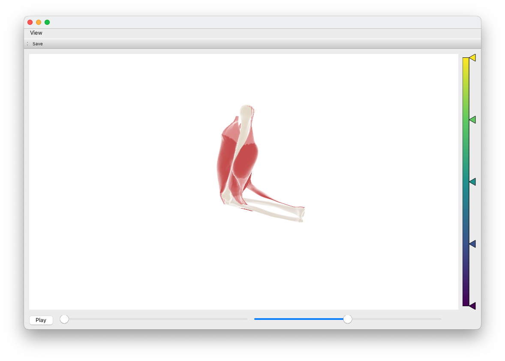
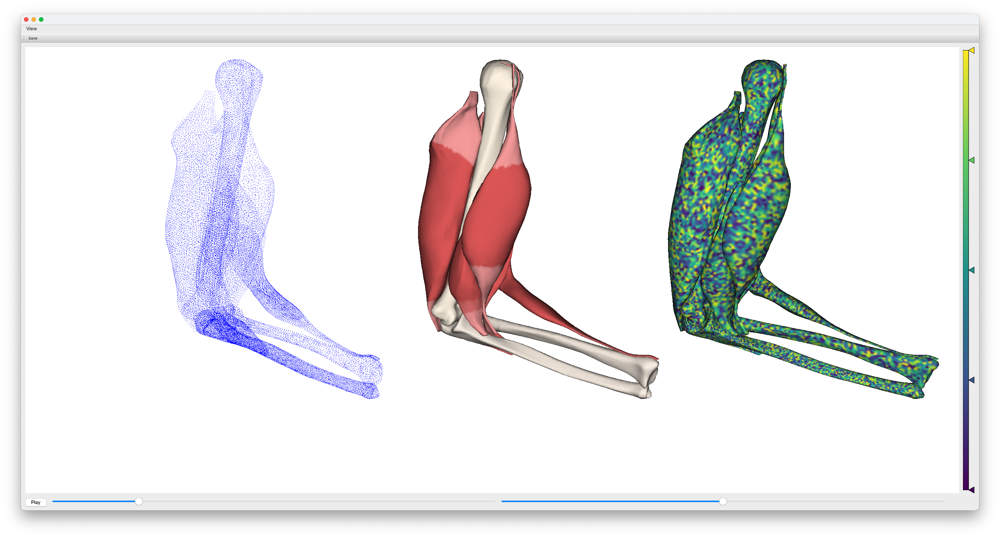
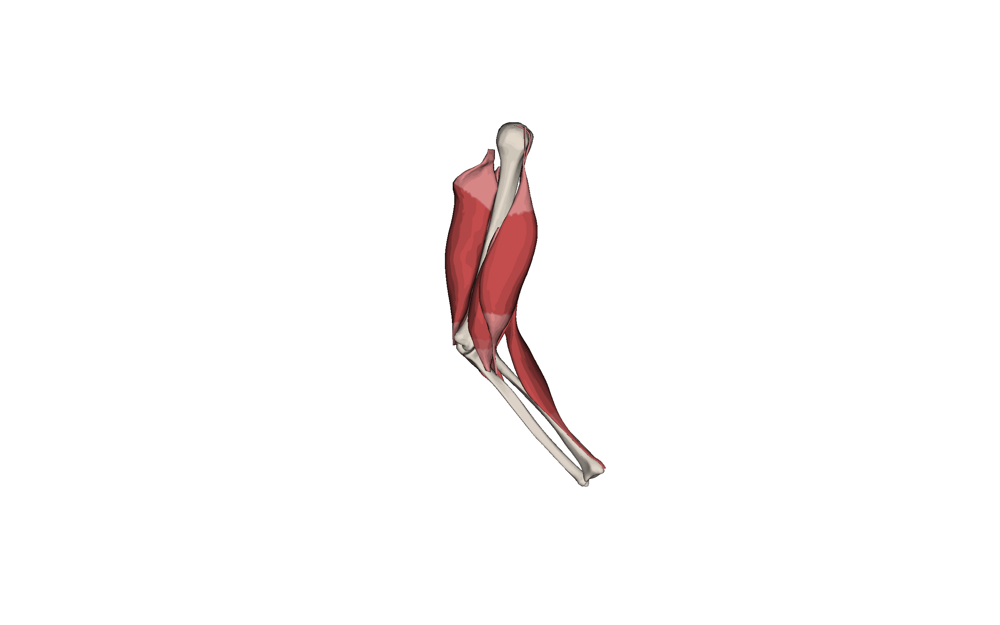

# Visualizer-3D 
Tool for three-dimensional animations of geometries like FE meshes.  




# Features
This repository implements a OpenGL-based gui for three-dimensional animations of geometries like FE meshes. 
It can be used to visualize results, e.g. from transient simulations or to inspect the geometry itself.
Moreover, it can be used to export the animations for presentations or publications.

## Installation

You can either clone the repository and install the package locally or install it directly from PyPI.

### PyPI

```bash
pip install visualizer-3d
```

### Local
Clone this repository and install it to your local environment as package using pip:

```bash
git clone git@github.com:jkneifl/Visualizer.git
cd Visualizer
pip install -e .
```

## Usage

The base class `Visualizer` can be used to create animations of geometries.
It has a method `animate` that can be used to create animations of geometries.

```python
from visualizer import Visualizer

coordinates = ...
faces = ...
colors = ...
# create a visualizer object
visualizer = Visualizer()
visualizer.animate(
    coordinates=coordinates,
)
```
It can animate point clouds, or meshes if the corresponding faces are provided.
For a detailed description of the parameters, see the docstring of the `animate` method.

You can also visualize multiple objects with different colors (specified by rgb values for every coordinate, by a string, or by error_values over an color map) and e.g. as points
random_colors = np.random.rand(*coordinates.shape[0:2])
```python
visualizer.animate([coordinates, coordinates, coordinates],
            faces=[None, faces, faces],
            color=["blue", colors, random_colors],
            shift=True,
            camera_distance=1000,
            )
```


In the `examples` folder, you can find an example script with according data on how to use the `Visualizer` class.

You can also export the animations as gif or mp4 files. An example is shown below:


